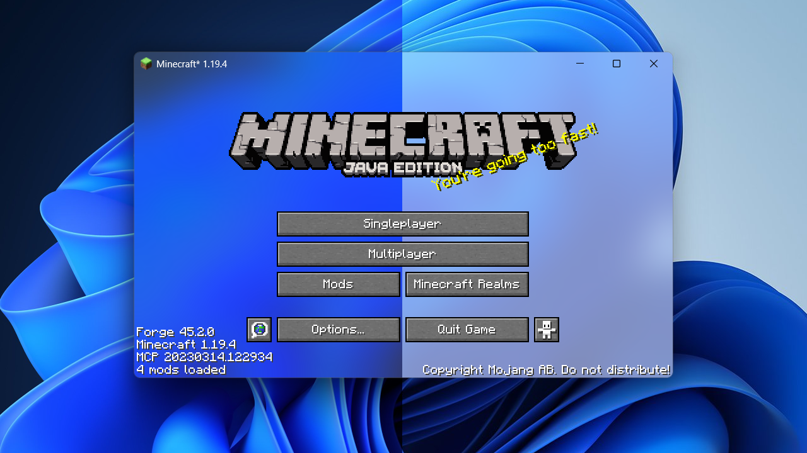

# AcryliCraft
Apply Fluent Design materials to Minecraft window.

## System Requirement

This mod requires **Windows 11 Version 22H2** (OS build 22621) or above to function correctly, otherwise the Fluent Design materials will not be applied and the background will be fully transparent.

## Mod Dependencies

Acrylic depends on [YetAnotherConfigLib](https://modrinth.com/mod/yacl) as its configuration library. Additionally, you will need [Mod Menu](https://modrinth.com/mod/modmenu) placed in your mods folder to access mod config if using Fabric.

For Forge 1.20 and above, it is also necessary to disable FML splash screen for the translucent game window to be properly initialized. This can be done by setting `earlyWindowControl` in `.minecraft\config\fml.toml` to `false`. Note that this MIGHT lead to malfunction for some rendering mods which leverages advanced OpenGL features, so proceed at your own risk.

## Known Issues

Some NVIDIA graphics cards don't render translucency properly for Minecraft's window (or any other GLFW window), in which case the window background would appear black. This is likely an issue with their drivers and is unfortunately not solveable on my end. Switching to another graphics card should make it work, if you happen to have one installed on your machine.