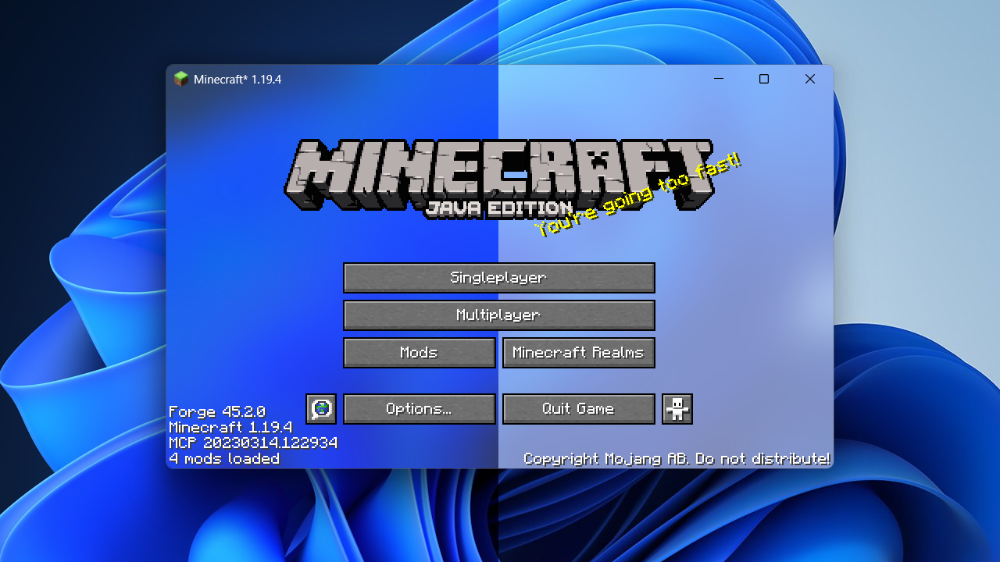

# AcryliCraft

Apply Fluent Design materials to the Minecraft window.

## System Requirement

Fluent design materials, dark mode, and border customization are exclusive to **Windows 11 Version 22H2** (OS build 22621) or later. However, you can still utilize this mod on other operating systems to get the window background transparent, and then use other tools (e.g., [Blur My Shell](https://extensions.gnome.org/extension/3193/blur-my-shell/) for GNOME) for further customizations.

## Mod Dependencies

Acrylic depends on [YetAnotherConfigLib](https://modrinth.com/mod/yacl) as its configuration library. Additionally, you will need [Mod Menu](https://modrinth.com/mod/modmenu) placed in your mods folder to access mod config if using Fabric.

For Forge/NeoForge 1.20 and later, it is also necessary to disable the FML splash screen for the translucent game window to be properly initialized. This can be done by setting `earlyWindowControl` in `.minecraft\config\fml.toml` to `false`. Note that this MIGHT lead to malfunctions for some rendering mods that leverage advanced OpenGL features, so proceed at your own risk.

## Known Issues

Some NVIDIA graphics cards don't render translucency properly for Minecraft's window (or any other GLFW window), in which case the window background would appear black. This is likely an issue with their drivers and is unfortunately not solveable on my end. Switching to another graphics card should make it work, if you happen to have one installed on your machine.

For Minecraft 26.2+, there is a known issue with window transparency when using Vulkan backend. This is likely a problem with how the LWJGL GLFW library bundled with Minecraft handles X11 visual(Wayland is also affected because it then goes through XWayland), and is not currently addressable. Consider switching to OpenGL if you encounter this.

## License

This project is open source under the MIT License. You can view it [here](https://opensource.org/license/mit).

## Credits

This mod was inspired by some other open source projects. Here's a list of them:
* [Mica](https://modrinth.com/mod/mica): Minecraft Mod / Enable Mica, Acrylic on Windows 11 21H2 22000 or later.
* [jSystemThemeDetector](https://github.com/Dansoftowner/jSystemThemeDetector): Java library for detecting that the (desktop) operating system uses a dark UI theme or not.
